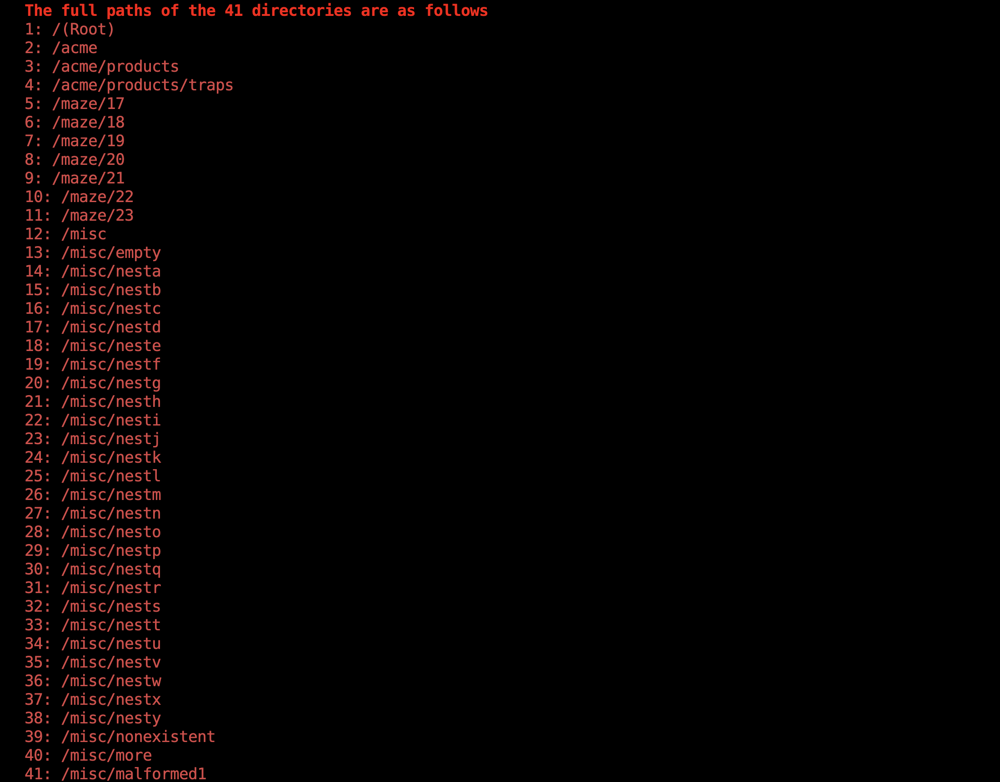
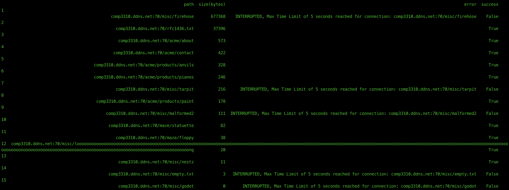
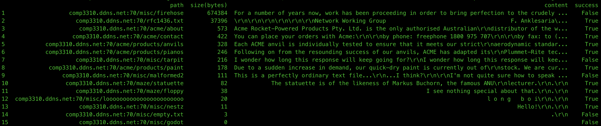
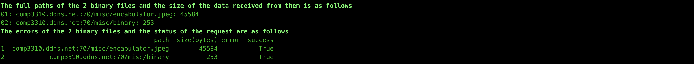
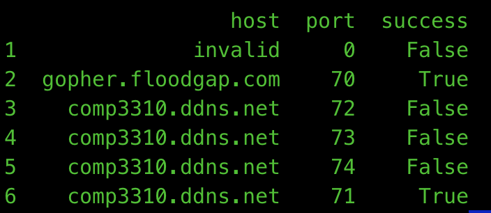

## Assignment 2: Gopher Index

### Directories

  * There are 41 Directories that the indexer was able to find.
  * Their full paths are as follows:
	* 
	
 *  The data for each directory is stored using a custom [Dir](Artifacts/Dir.py) object.
	 
```python
from dataclasses import dataclass
from typing_extensions import Self
from dataclasses import field

@dataclass(frozen=True)
class Dir:
	path    : str
	raw     : bytes
	error   : str = ''
	lines   : list[str] = field(init=False)
	success : bool = field(init=False)

def __post_init__(s: Self):
	lines = s.raw.decode("utf-8", "replace").splitlines()
	if lines and lines[-1] == '.': lines.pop()
	object.__setattr__(s, 'lines', s.raw.decode("utf-8", "replace").splitlines())
	object.__setattr__(s, 'success', False if s.error else True)

def __str__(s: Self)->str: return .path
```
* The indexer stores the information of each directory in a [Dir](Artifacts/Dir.py) object. The object contains information about the raw data, error encountered(if any) while receiving data, the lines that are basically computed from the raw data received and whether all data was received successfully according to the indexer.

### Text Files

* There are 15 text files that the indexer was able to find. Their paths alongside their sizes are as follows(The ones in red gave are the ones which can cause the indexer to halt if not managed properly).
	* 
* The maximum data received from a text file was from `/misc/firehose` before the connection was interrupted as the server never stopped sending data for that file.
* As you can see, the indexer was able to receive some data for all text files except `misc/godot`. 
	* 

* The indexer stores the text file data in [TextFile](Artifacts/TextFile.py) object.

```python
from dataclasses import dataclass
from typing_extensions import Self
from dataclasses import field

@dataclass(frozen=True)
class TextFile:
	path : str
	raw : bytes
	error : str
	content : str = field(init=False)
	size : int = field(init=False)
	success : bool = field(init=False)

def __post_init__(s: Self):
	object.__setattr__(s, 'content', s.raw.decode("utf-8", "replace"))
	object.__setattr__(s, 'success', True if not s.error else False)
	object.__setattr__(s, 'size', len(s.raw))

def __str__(s: Self)->str: return s.path
```

* The requests for which data connection was closed after reading the entire data was received followed by successful termination of the connection with the address of the file are successful. Requests where no data was received or the indexer had to interrupt the connection are not considered to be completed successfully. But the indexer stores whatever data was received before the receive is interrupted in the TextFile object.
* There are different ways that these bad receives from the server are handled, they will be discussed in a later section.
* Largest File
	* ``comp3310.ddns.net:70/misc/firehose``  
		* Size of Data Received(Bytes)(For Time Limit of 5 seconds)
			* 676988
		* Sample of the Content:
			*  ``b'For a number of years now, work has been proceeding in order to bring perfection to the crudel`` ...
* Smallest File
	* ``comp3310.ddns.net:70/misc/godot`` 
	* No Data Received
* Smallest File with data
	* ``comp3310.ddns.net:70/misc/empty.txt`` 
	* Size of Data Received(Bytes)
		* 3
	*  Content
		* ``.\r\n``
		* This is basically the end term for text data transfer gophers.

* Some More Samples of the content
	* 


### Binary Files
* 2 Binary Files were found and the data for them was received successfully.
* 
* Smallest File
	* ``comp3310.ddns.net:70/misc/binary``
	* bytes received: 253
* Largest File
	* ``comp3310.ddns.net:70/misc/encabulator.jpeg``
	* bytes received: 45584

### External Servers

* The following external servers were found(True means they are up, False means they are down).



