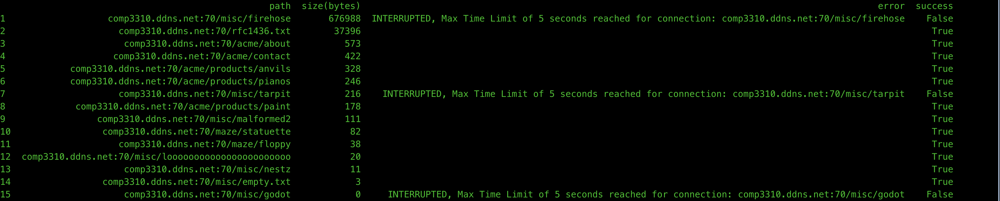

## Assignment 2: Gopher Index
### Installation

* Install Miniconda
* Run 
	* ``conda env create -f gopher-env.yaml``
	* `conda activate gopher-client`
### Running the Indexer(Client)
* Run
	* ``python GopherClient.py``
### Initial Server Connection

*  Wireshark (just) this initial-response conversation in both directions, from the starting TCP connection (SYN) to its closing, and include a screenshot of that Wireshark summary in your report (don’t expand to the lowest level, one row per packet/message is plenty).
* 
### Indexer prints requests and responses with timestamps
* 

### Directories

  * There are 41 Directories that the indexer was able to find.
  * Their full paths are as follows:
	* 
	
 *  The data for each directory is stored using a custom [Dir](Artifacts/Dir.py) object.
	 
```python
from dataclasses import dataclass
from typing_extensions import Self
from dataclasses import field

@dataclass(frozen=True)
class Dir:
	path    : str
	raw     : bytes
	error   : str = ''
	lines   : list[str] = field(init=False)
	success : bool = field(init=False)

def __post_init__(s: Self):
	lines = s.raw.decode("utf-8", "replace").splitlines()
	if lines and lines[-1] == '.': lines.pop()
	object.__setattr__(s, 'lines', s.raw.decode("utf-8", "replace").splitlines())
	object.__setattr__(s, 'success', False if s.error else True)

def __str__(s: Self)->str: return .path
```


### Text Files

* There are 15 text files that the indexer was able to find. Their paths alongside their sizes are as follows(The ones in red gave are the ones which can cause the indexer to halt if not managed properly).
	* 
* The maximum data received from a text file was from `/misc/firehose` before the connection was interrupted as the server never stopped sending data for that file.
* As you can see, the indexer was able to receive some data for all text files except `misc/godot`. 
	* 

* The Text file definition can be found in [Artifacts/TextFile.py](Artifacts/TextFile.py) object. 

```python
from dataclasses import dataclass
from typing_extensions import Self
from dataclasses import field
from json import dump
from os.path import exists
from os import makedirs
from os.path import join

@dataclass(frozen=True)

class TextFile:

	path           : str
	raw            : bytes
	error          : str
	log_dir        : str
	content        : str = field(init=False)
	size           : int = field(init=False)
	success        : bool = field(init=False)
	text_files_dir : str = field(init=False)

def __post_init__(s: Self):
	object.__setattr__(s, 'content', s.raw.decode("utf-8", "replace"))
	object.__setattr__(s, 'success', True if not s.error else False)
	object.__setattr__(s, 'size', len(s.raw))
	object.__setattr__(s, 'text_files_dir', join(f"{s.log_dir}", "TextFiles"))

	if not exists(s.text_files_dir): makedirs(s.text_files_dir, exist_ok=True)
	destination = join(f"{s.text_files_dir}", f"{s.path.replace('/', '-')}.json")
	dump(s.content, open(destination, 'w+'))

def __str__(s: Self)->str: return s.path
```

* If the server terminates connection after successfully sending data, a request is considered successful. The file must also contain ``'.\r\n'`` in the end for the indexer to know that it has ended. Otherwise it will wait until some timeout has occured. This was done to separate files that end with ``'.\r\n'`` from the files that don't.
* Requests where no data was received, file did not end with ``'.\r\n'`` or the indexer had to interrupt the connection are not considered to be completed successfully. But the indexer stores whatever data was received before some exception is triggered in the TextFile Object.
* There are different ways that these bad receives from the server are handled, they will be discussed in a later section.
* Largest File
	* ``comp3310.ddns.net:70/misc/firehose``  
		* Size of Data Received(Bytes)(For Time Limit of 5 seconds)
			* 676988
		* Sample of the Content:
			*  ``b'For a number of years now, work has been proceeding in order to bring perfection to the crudel`` ...
* Smallest File
	* ``comp3310.ddns.net:70/misc/godot`` 
	* No Data Received
* Smallest File with data
	* ``comp3310.ddns.net:70/misc/empty.txt`` 
	* Size of Data Received(Bytes)
		* 3
	*  Content
		* ``.\r\n``
		* This is basically the end term for text data transfer in gophers.

* Some More Samples of the content
	* 

#### Handling Bad Receives

* The indexer puts a cap on the amount of data the server can send. If you change the ``DEFAULT_TIMEOUT`` value from 5 to 20 seconds, and keep the ``MAX_DOWNLOAD_SIZE = 1024 * 1024``, you will observe that instead of a timeout error, the indexer will catch a different error related to the maximum download size. So the problem of the sever continuously sending data there is handled using multiple checks.

* For files that do not end with '``.\r\n'`` the indexer collects data but does not exit the receiving loop because the end of file character has not reached. It does leave even if server stops sending information. It only receives after a socket timeout, total receive time timeout, or a thread timeout. This helps distinguish files that follow proper syntax from those that don't.
* Please check the [GopherClient._worker](GopherClient.py) for more clarity.

#### Content
Please check [Logs/TextFiles](Logs/TextFiles) for content of the text files.

### Binary Files(2)
* 2 Binary Files were found and the data for them was received successfully.
* Similar to text files, information pertaining to Binary files is stored in the BinaryFiles class in [Artifacts/BinaryFile.py](Artifacts/BinaryFile.py) 

	*  
* Smallest File
	* ``comp3310.ddns.net:70/misc/binary``
	* bytes received: 253
* Largest File
	* ``comp3310.ddns.net:70/misc/encabulator.jpeg``
	* bytes received: 45584

* For Binary files, the \_worker checks whether the server has stopped sending data in order to to break out of the receiving loop.
#### Content
The content of the Binary files can be found in Logs/BinaryFiles
### External Servers(6)

* The following external servers were found(True means they are up, False means they are down).
	* 

### Bad Directory Lines(41)

* Another problem that we encounter is bad directory lines. The client gives the following message after coming across a directory line with improper description.
	 * ```FAILED, Invalid Gopher menu line format. Expected format: <type><desc><selector><host><port>. Got: ({line}) from {dir}```
	 * Where line is some line from a directory(dir).
	
* There are 42 such cases. This happens because the line does not correspond to a valid address on the server.
	* 


## Some more points

* I have used immutable classes in order to avoid conflicts due to multithreading, although it was probably unnecessary.
* All the errors that my client was able to come across are explicitly handled.
* In case the tutor decides to test this on some other gopher, I have added a general exception to the try catch blocks. Hopefully, it works.
* Tried a different approach with my coding style.
* I use a mac, hopefully it works on a windows since I am using miniconda.

